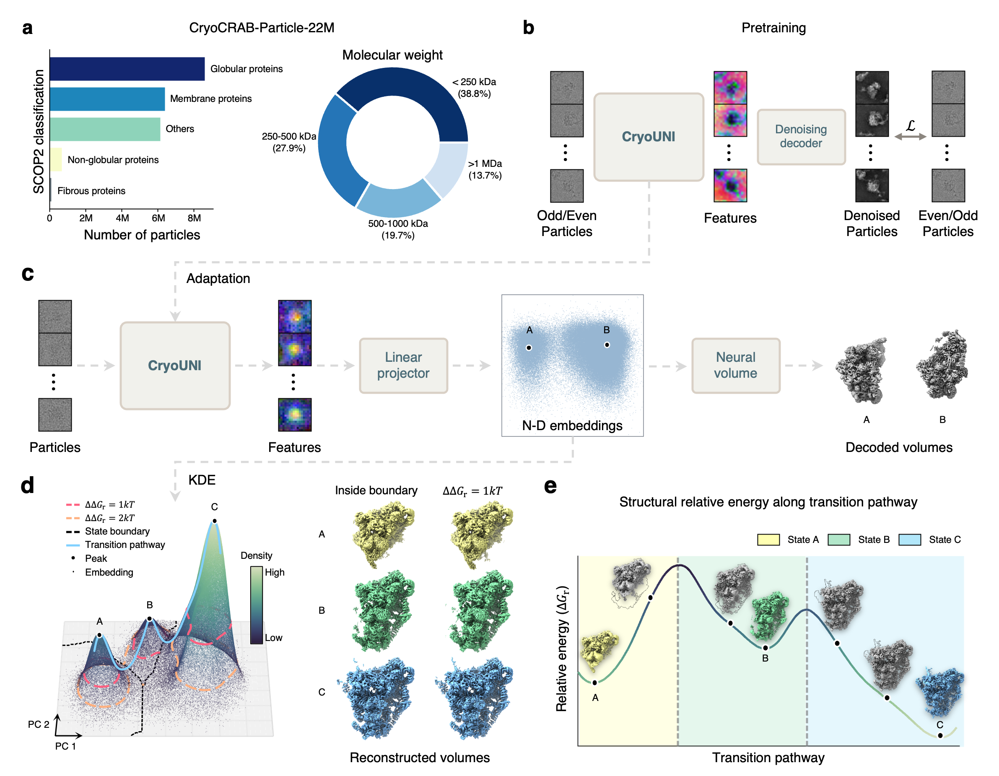

# CryoUNI: Cryo-EM as latent structural landscape microscopy

[[Paper]](#citation) | [[Model Weights]](https://zenodo.org/records/19513130)



CryoUNI is a universal pretrained encoder for cryo-EM particle images. It maps particles into a probabilistic latent space where density reflects the Boltzmann distribution of conformational states, enabling direct construction of conformational energy landscapes. Combined with **WAVE** (Watershed Analysis of Variational Embeddings), it provides an automated pipeline for conformational state identification, energy landscape analysis, and transition pathway planning.

## Key Features

- **Universal pretrained backbone** trained on 22M particles across 746 proteins (CryoCRAB-Particle-22M)
- **Physically grounded latent space** where density corresponds to conformational state occupancy
- **WAVE pipeline** for automated analysis: KDE density estimation, peak detection, watershed segmentation, and trajectory planning via Fast Marching Method
- **Energy-based particle selection** for high-purity conformational subsets
- **GPU-accelerated analysis** with RAPIDS cuML support

## Installation

### Conda (recommended)

```bash
git clone https://github.com/Cellverse/cryouni.git --recursive
cd cryouni
bash install.sh # creates conda env "cryouni" with all dependencies
conda activate cryouni
```

### Docker

```bash
docker build -f dockerfile -t cryouni .
```

## Model Weights

Download pretrained CryoUNI weights from [Zenodo](https://zenodo.org/records/19513130) (DOI: 10.5281/zenodo.19513130):

| Model | Parameters | Download |
|-------|-----------|----------|
| CryoUNI-S (small) | D=384, L=12 | [cryouni-s.ckpt](https://zenodo.org/records/19513130/files/cryouni-s.ckpt) (85.7 MB) |
| CryoUNI-B (base)  | D=768, L=12 | [cryouni-b.ckpt](https://zenodo.org/records/19513130/files/cryouni-b.ckpt) (341.1 MB) |

Model weights are released under [CC-BY-NC-4.0](https://creativecommons.org/licenses/by-nc/4.0/).

## Data Preparation

Supported particle image formats:

| Format | Extensions | Notes |
|--------|-----------|-------|
| HDF5 | `.h5` | Recommended. Self-contained: particles, poses, and CTF in a single file |
| MRC/MRCS | `.mrc`, `.mrcs` | Requires separate poses and CTF pickle files |
| STAR | `.star` | RELION star file. Requires separate poses and CTF pickle files |
| cryoSPARC | `.cs` | cryoSPARC job output. Requires separate poses and CTF pickle files |
| Text list | `.txt` | Text file listing particle `.mrcs` paths. Requires separate poses and CTF pickle files |

### Using non-HDF5 formats

For `.star`, `.cs`, `.mrc`, `.mrcs`, and `.txt` inputs, poses and CTF must be provided as separate pickle files. We provide built-in parsing tools (no need to install cryoDRGN):

**From RELION `.star` files:**
```bash
# Extract both poses and CTF
python -m cli.parse_star --star particles.star --poses poses.pkl --ctf ctf.pkl

# Optionally override parameters
python -m cli.parse_star --star particles.star --poses poses.pkl --ctf ctf.pkl \
    --D 256 --Apix 1.5 --kv 300 --cs 2.7 -w 0.1
```

**From cryoSPARC `.cs` files (direct):**
```bash
python -m cli.parse_csparc --cs particles.cs --poses poses.pkl --ctf ctf.pkl --D 256
```

**From cryoSPARC jobs (via pyem):**

For complex cryoSPARC workflows (e.g., restack jobs with multiple `.cs` files), we recommend first converting to `.star` format using [pyem](https://github.com/asarnow/pyem), then parsing the `.star` file:

```bash
# Step 1: Install pyem (one-time setup, see https://github.com/asarnow/pyem)
pip install pyem

# Step 2: Convert cryoSPARC .cs to .star using pyem's csparc2star
#   Input .cs files depend on the job type — typical examples:
#     - Restack: {JOB}_passthrough_particles.cs + restacked_particles.cs
#     - Refinement: {JOB}_particles.cs
csparc2star.py <input.cs> [additional.cs ...] output.star

# Step 3: Parse poses and CTF from the .star file
python -m cli.parse_star --star output.star --poses poses.pkl --ctf ctf.pkl
```

The output pickle files follow the [cryoDRGN](https://github.com/ml-struct-bio/cryodrgn) format convention and are also compatible with cryoDRGN's `parse_pose_star` / `parse_ctf_star` outputs.

### Converting to HDF5 (recommended)

Once you have poses and CTF pickle files, you can pack everything into a single `.h5` file for faster I/O:

```bash
python -m cli.convert_to_h5 \
    --particles /path/to/particles.star \
    --poses poses.pkl --ctf ctf.pkl \
    --out particles.h5

# For .star/.cs inputs where .mrcs paths are relative, specify --datadir
python -m cli.convert_to_h5 \
    --particles /path/to/particles.star \
    --poses poses.pkl --ctf ctf.pkl \
    --out particles.h5 \
    --datadir /path/to/mrcs/directory
```

Supports the same particle formats as training: `.star`, `.cs`, `.mrc`, `.mrcs`, `.txt`.

## Training & Analysis

See [`example/train.sh`](example/train.sh) for single-GPU, multi-GPU, and SLURM multi-node training examples with annotated config overrides.

See [`example/analyze.sh`](example/analyze.sh) for the full WAVE pipeline: dimensionality reduction, peak detection, watershed segmentation, and trajectory planning.

### Training with pickle files directly

You can also pass the pickle files directly without converting to HDF5:

```bash
python train.py --config-file ... \
    DATAMODULE.DATASET.PARTICLE_PATH /path/to/particles.star \
    DATAMODULE.DATASET.POSES_PATH /path/to/poses.pkl \
    DATAMODULE.DATASET.CTF_PATH /path/to/ctf.pkl \
    ...
```

## Citation

If you find this work useful, please cite:

```bibtex
@article{cryouni2026,
    author = {Dai, Haizhao and Chen, Qihe and Li, Lingqi and Shen, Yingjun and Xu, Zhenyang and Li, Minzhang and Xie, Yufan and Zheng, Jingjing and Liu, Zhijie and Sun, Liping and Pei, Yuan and Zhang, Jiakai and Yu, Jingyi},
	title = {Cryo-EM as latent structural landscape microscopy},
	elocation-id = {2026.04.10.717737},
	year = {2026},
	doi = {10.64898/2026.04.10.717737},
	publisher = {Cold Spring Harbor Laboratory},
    URL = {https://www.biorxiv.org/content/10.64898/2026.04.10.717737v2},
	eprint = {https://www.biorxiv.org/content/10.64898/2026.04.10.717737v2.full.pdf},
	journal = {bioRxiv}
}
```

## Acknowledgements

This project builds on:
- [coach-pl](https://github.com/DuskNgai/coach-pl) — PyTorch Lightning training framework
- [CryoCRAB](https://github.com/Dylan8527/CryoCRAB) — CryoCRAB: A Large-scale Curated and Filterable Dataset for Cryo-EM Foundation Model Pre-training

This project also uses code adapted from:
- [cryoDRGN](https://github.com/ml-struct-bio/cryodrgn) - CryoDRGN: Deep Reconstructing Generative Networks for cryo-EM and cryo-ET heterogeneous reconstruction
